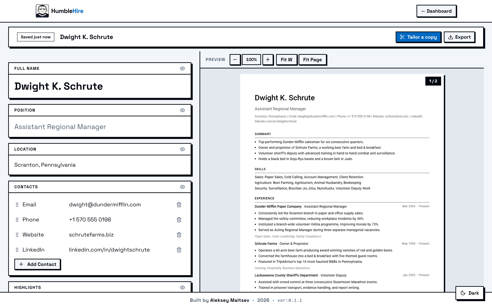

# HumbleHire

> One CV. Many targets.

HumbleHire is a free, open-source CV builder that runs entirely in your browser. You keep one master CV with your whole history in it, branch a tailored copy for each job you apply to, and export a clean PDF to send. Your CV content stays on your device and never reaches a server.

**[Try it at humblehire.cv →](https://humblehire.cv)**

<picture>
  <source media="(prefers-color-scheme: dark)" srcset="docs/assets/editor.dark.png">
  
</picture>

## Why it exists

Most of us keep one CV and rewrite it for every application. You copy the file, trim it for the role, export, apply, and repeat. A dozen applications later the folder is a graveyard of `cv_v3_backend_FINAL2.pdf`, and there is no record of which copy went where or what changed when you last touched the master.

HumbleHire keeps the master as your single source of truth. Tailored copies branch off it and stay linked back, so when the master changes you can decide, copy by copy, what to pull in and what to leave alone.

## What you can do with it

- **Keep one master, branch many copies.** The master holds your full record. A tailored copy is a job-specific cut of it that remembers where it came from.
- **Pull master changes in, on your terms.** When the master changes, each tailored copy shows you what is different. Accept the changes that fit the role and discard the rest. Sync only ever runs from master to copy, and a discarded change stays discarded until the master moves again.
- **Edit and preview in one place.** The editor and the rendered CV sit side by side, so every change shows up immediately and saves on its own. Any block can be hidden without throwing away its content, so a single master can back copies that read very differently from one another.
- **Find a CV fast.** Everything lives in one dashboard, with tailored copies nested under the master they branched from. A copy is never stranded away from its source.
- **Export a PDF in one click.** The preview you edit against is the file you send. Hidden and empty blocks are left out of the export automatically.

The CV structure is deliberately fixed: nine blocks, in a set order. That keeps the output consistent and easy for applicant tracking systems to parse, and it is one less thing to fiddle with when you should be applying.

## Local-first, and what that means

Your CVs are stored in your browser. There is no account and no sync server, and the content of your CVs never leaves your device. Two things follow from that:

- It is fast. Saves are instant because nothing travels over the network.
- The backups are your job. Clearing your browser data wipes your CVs, so export the ones that matter. I recommend installing the PWA so your CVs won't be lost by automatic browser data clearing.

The hosted site at [humblehire.cv](https://humblehire.cv) collects anonymous, cookieless usage metrics so I can see what gets used. That is the only network traffic tied to you, and it carries none of your CV content. If you run your own copy, that is off by default.

## Running it yourself

HumbleHire uses [pnpm](https://pnpm.io/).

### Develop locally

```bash
pnpm install
pnpm dev           # start the dev server at localhost:5173
pnpm test:unit     # unit tests (Vitest)
pnpm test:e2e      # end-to-end tests (Playwright)
pnpm storybook     # browse components in isolation
```

### Deploy your own copy

The app builds to a plain static site, so you can host it anywhere that serves files.

```bash
pnpm build         # output lands in build/
pnpm preview       # serve the production build locally to check it
```

It is a single-page app. Point your host's fallback at `index.html` so deep links like `/cv/<id>` resolve.

## Built with

- [Svelte 5](https://svelte.dev/) and [SvelteKit](https://kit.svelte.dev/)
- [TailwindCSS](https://tailwindcss.com/)
- [TypeScript](https://www.typescriptlang.org/)

## Thanks

To the libraries doing the heavy lifting:

- [pdfmake](https://github.com/bpampuch/pdfmake) generates the exported PDF in the browser
- [PDF.js](https://github.com/mozilla/pdf.js) renders the live preview
- [Dexie.js](https://dexie.org/) is the storage layer over IndexedDB
- [@dnd-kit/svelte](https://dndkit.com/svelte/quickstart/) handles drag and drop
- [Shadcn-Svelte](https://shadcn-svelte.com/) and [bits-ui](https://bits-ui.com/) provide the UI primitives

## Documentation

- [docs/OVERVIEW.md](docs/OVERVIEW.md) covers the project in more depth
- [docs/features/](docs/features/) explains each feature on its own
- [docs/decisions/](docs/decisions/) records the architecture decisions and why they went the way they did

## License

[MIT](LICENSE) © Aleksey Maltsev
